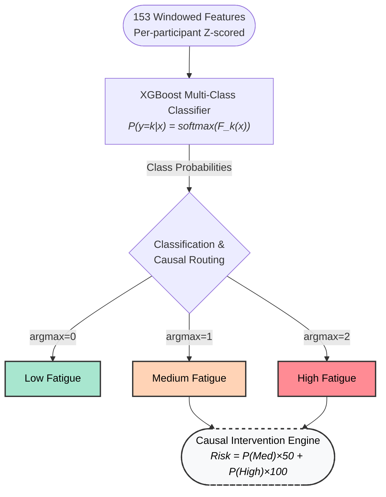

# Invention Disclosure Format (IDF)-B

**Document No.:** 02-IPR-R003  
**Issue No/Date:** 2/01.02.2024  
**Amd. No/Date:** 0/00.00.0000

---

**Title of the Invention:** A Smart Worker Safety System for Fatigue Detection Using Causal AI

---

## 2. Field / Area of Invention

The present invention relates to the field of wearable health monitoring systems, physiological signal processing, machine learning, and causal artificial intelligence (Causal AI). More particularly, the invention pertains to a multi-modal wearable-based system and method for real-time classification and causal explanation of human fatigue states using physiological signals including electroencephalography (EEG) band powers (alpha, beta, theta, delta, gamma), heart rate (HR), electrodermal activity (EDA), blood volume pulse (BVP), and skin temperature, collected from a headband-type EEG sensor (Muse S) and a wristband sensor (Empatica E4).

---

## 3. Prior Patents and Publications from Literature

| Patent / Paper Identifier | Year | Title | Technology & Algorithms Used | Limitations vs. Our Approach |
|---|---|---|---|---|
| US 2022/0180725 A1 | 2022 | Smart Wearable Personal Safety Devices | • Wearable physiological & motion sensors • Feature extraction from biosignals • Supervised ML models (Random Forest / SVM / rule-based) • Threshold-based alerting | Uses correlation-driven classifiers treating fatigue as static pattern recognition. Random Forest provides feature importance but cannot model temporal causality or lagged effects. Our system uses XGBoost multi-class classification with per-participant z-score normalization and a separate PCMCI causal discovery module, enabling lag-aware cause–effect explanations and causal root-cause intervention routing, not just predictions. |
| EP 3054836 A1 | 2016 | Fatigue Monitoring and Management System | • EEG, HRV signal processing • Statistical feature extraction • Subject-specific baseline calibration • Classical ML classifiers (logistic regression, SVM) | Focuses on fatigue detection accuracy, not causal reasoning. Baselines are applied only for scaling, whereas our system uses per-participant z-score normalization to improve both ML robustness and causal graph stability. No ensemble boosting (XGBoost) and no causal inference layer, hence no explanation of why fatigue evolves. |
| US 2016/0113587 A1 | 2016 | Artifact Removal Techniques with Signal Reconstruction | • Signal filtering algorithms • Motion artifact detection • Signal reconstruction (adaptive filters, interpolation) • No predictive ML | Limited strictly to signal conditioning. Does not perform fatigue inference, ML prediction, or explanation. Our system builds on cleaned signals and adds feature abstraction, ML fatigue classification, and causal reasoning, which this patent does not address. |
| US 11,299,564 B2 | 2022 | Pattern Discovery & Causal Effect Estimation in Time Series | • Time-series pattern mining • Regression-based causal effect estimation • Event/failure prediction models | Focuses on event prediction, not continuous physiological state classification. Causality is embedded within prediction and often assumes stationarity or coarse temporal resolution. Our system uses PCMCI conditional independence testing across lags, learns a stable causal graph offline, and applies it online independently of the ML predictor, avoiding causal–predictive entanglement. |
| US 8,571,803 B2 | 2013 | Systems for Modeling Causal Biological Networks | • Bayesian network inference • DAG construction from biological datasets • Probabilistic graphical models | Designed for molecular/biological networks, not real-time wearable physiology. Bayesian networks are often static or weakly temporal and computationally heavy. Our approach uses PCMCI (explicitly temporal, lag-aware, scalable) and integrates it with real-time ML fatigue classification, which this patent does not disclose. |
| WO 2016/036958 A1 | 2016 | Causal Inference in Network Structures using Belief Propagation | • Bayesian networks • Belief propagation algorithms • Probabilistic causal inference in health data | Produces probabilistic causal beliefs, often opaque and computationally expensive. Does not generate deterministic, feature-level causal evidence per prediction. Our system outputs structured, machine-readable causal drivers (feature, direction, lag) derived from PCMCI, enabling auditability and safety-critical deployment. |
| Runge et al., Science Advances | 2019 | Detecting and Quantifying Causal Associations in Large Nonlinear Time Series Datasets | • PCMCI causal discovery algorithm • Conditional independence testing • Lag-aware causal graph estimation for nonlinear time series | Provides foundational causal discovery methodology only. Does not disclose any wearable system, fatigue classification, ML classification, or online explanation engine. Our invention operationalizes PCMCI within a complete wearable fatigue monitoring pipeline with ML prediction and real-time causal explanations. |
| Fekete et al., IJPR | 2025 | A Comprehensive Causal AI Framework for Analysing Factors Affecting Energy Consumption | • Causal discovery (DirectLiNGAM, RESIT) • Causal inference (DoWhy) • Offline causal analysis for industrial data | Applies causal AI to manufacturing energy analytics, not physiology. No wearable signals, no fatigue modeling, no real-time inference. Does not combine ML prediction + causal explanation in an online system. Our work extends causal AI into wearable-based physiological fatigue classification with real-time causal attribution. |
| Varidel et al., JMIR | 2025 | Causal AI Recommendation System for Digital Mental Health | • Structural Causal Models (SCM) • Bayesian DAG sampling (MCMC) • Do-operator–based intervention simulation | Relies on self-report questionnaire data, not physiological signals. Focuses on intervention recommendation, not fatigue classification. No signal processing, no ML classification, no temporal causal discovery like PCMCI. Our system uniquely targets real-time physiological fatigue classification with lag-aware causal explanations. |

---

## 4. Summary and Background of the Invention (Address the Gap / Novelty)

Mental fatigue is a critical risk factor in domains such as industrial safety, healthcare, transportation, and cognitive performance monitoring. Existing fatigue monitoring systems predominantly rely on correlation-driven machine learning models that treat physiological signals as independent predictors. While such approaches can classify fatigue states, they fail to explain *why* fatigue occurs, *how* signals influence one another over time, or *which* physiological mechanisms drive risk escalation.

**The key gaps in existing solutions are:**

- Absence of causal inference in fatigue classification pipelines
- Inability to provide interpretable, mechanism-level explanations for each prediction
- Poor generalization across unseen participants due to physiological baseline differences
- No causal root-cause routing to prescribe targeted interventions based on identified physiological drivers

**The present invention addresses these gaps by introducing a causal, multimodal fatigue intelligence system that:**

- Fuses heterogeneous wearable signals (EEG, HR, EDA, BVP, skin temperature) into window-level physiological representations with 153 engineered features
- Applies per-participant z-score normalization to eliminate inter-subject physiological baseline differences
- Uses a gradient-boosted decision tree classifier (XGBoost) with Optuna-tuned hyperparameters and Leave-One-Subject-Out cross-validation for robust 3-class fatigue classification (Low / Medium / High)
- Performs time-series causal discovery using PCMCI (Tigramite) to uncover directed, time-lagged relationships between 12 physiological variables and fatigue
- Implements a causal root-cause routing engine that maps model predictions to specific intervention pathways (drowsiness, cognitive overload, physical stress, compounding fatigue) based on both the classification output and the discovered causal structure

This integration of causal discovery, multi-class fatigue classification, per-participant normalization, and causal root-cause intervention routing in a single wearable pipeline constitutes the core novelty of the invention.

---

## 5. Objective(s) of Invention

1. To develop a wearable-based system that ingests multi-modal physiological data (5-band EEG from a headband sensor, heart rate, electrodermal activity, blood volume pulse, and skin temperature from a wristband sensor) to classify fatigue levels in real-time.

2. To implement a Per-Participant Z-Score Normalization module that standardizes physiological features using each participant's own session-level statistics (mean and standard deviation), ensuring robust performance across different users regardless of individual physiological baselines.

3. To integrate a Causal Discovery Module (utilizing the PCMCI algorithm from Tigramite) that identifies statistically significant, time-lagged causal links between 12 physiological variables and the target fatigue state, with lags up to 2 minutes.

4. To improve cross-subject and cross-session robustness of fatigue prediction using Leave-One-Subject-Out (LOSO) cross-validation and Optuna hyperparameter optimization, minimizing the variance caused by individual physiological differences.

5. To support decision-making and intervention planning via a causal root-cause routing engine that maps each fatigue prediction to a specific intervention pathway — for example, "Immediate break due to drowsiness (elevated Theta/Beta ratio)" vs. "Task rotation due to cognitive overload (elevated Beta EEG)" vs. "Hydration break due to physical stress (elevated EDA + HR)" — based on the specific physiological drivers identified by both the model and the causal graph.

---

## 6. Working Principle of the Invention (in brief)

The present invention operates through three primary functional modules: (1) Data Processing and Feature Engineering, (2) Predictive Modeling, and (3) Causal Discovery. These modules operate sequentially to transform raw physiological time-series data into interpretable fatigue classifications and causal explanations.



### Module 1 – Data Processing & Feature Engineering

This module processes multivariate physiological time-series data from the FatigueSet dataset, which contains recordings from 12 participants each performing 3 sessions of varying fatigue intensity (Low, Medium, High). Each session contains timestamped sensor data from 9 sensor files across two wearable devices.

**Preprocessing**

Preprocessing includes:

- **Timestamp Alignment:** Each sensor file contains millisecond-epoch timestamps. Timestamps are converted to datetime objects and used as the time index.
- **60-Second Window Aggregation:** All sensor signals are resampled into non-overlapping 60-second windows using aggregation (mean and standard deviation per channel). This produces a structured feature matrix where each row represents one minute of physiological activity.

**Feature Extraction**

Features extracted from each 60-second window include:

- **EEG band-power summaries:** Mean and standard deviation of 5 frequency bands (alpha, beta, theta, delta, gamma) across 4 electrode channels (TP9, AF7, AF8, TP10) — 40 base features
- **Wristband physiological signals:** Mean and standard deviation of heart rate, EDA, skin temperature, and BVP — 8 base features
- **Cross-sensor engineered ratios:** Alpha/Beta ratio (drowsiness index), Theta/Beta ratio (sustained attention marker), and EDA×HR interaction (sympathetic arousal) — 3 features
- **Temporal lag features:** For each of the 51 base features, lag-1 and lag-2 values (values from 1 and 2 minutes prior) are appended — 102 lag features
- **Total: 153 features per window**

**Per-Participant Z-Score Normalization**

Feature values are normalized per participant. For each participant, the mean and standard deviation of every feature across all their sessions is computed. Each feature value is then converted to a z-score relative to that participant's own baseline. This reduces inter-subject variability and converts absolute physiological values into "how far from this person's normal?" — dramatically improving generalization to unseen participants.

The output of this module is a structured feature set of 153 features per 60-second window.

### Module 2 – Predictive Modeling (XGBoost Classifier)

This module performs multi-class fatigue classification using a gradient-boosted decision tree classifier.

**Model Architecture**

- **XGBoost Classifier:** Trained with objective `multi:softprob` and 3 output classes (Low=0, Medium=1, High=2). Outputs a probability distribution over the three fatigue levels for each input window.

**Training Strategy**

- **Data Split:** Participants 1–9 are used for training; participants 10–12 are reserved as a completely held-out test set never seen during any training or tuning.
- **Leave-One-Subject-Out (LOSO) Cross-Validation:** During training, one participant is held out at a time for evaluation, rotating through all 9 training participants. This ensures the model is always evaluated on a participant it has never seen.
- **Balanced Sample Weighting:** Class weights are computed to upweight underrepresented fatigue levels, preventing the model from biasing toward the majority class.

**Hyperparameter Optimization**

Hyperparameters are optimized using Optuna (100 trials) with macro-F1 score as the objective. Parameters tuned include: n_estimators, max_depth, learning_rate, subsample, colsample_bytree, min_child_weight, gamma, reg_alpha, and reg_lambda.

**Decision Logic**

The XGBoost classifier outputs class probabilities P(Low), P(Medium), P(High). The predicted class is the argmax of these probabilities. Additionally, a continuous Fatigue Proximity Score (0–100) is derived from the probabilities: Risk = P(Medium) × 50 + P(High) × 100, capped at 100. This provides a smooth, continuous risk indicator alongside the discrete classification.

### Module 3 – Causal Discovery (PCMCI)

This module performs causal discovery using the PCMCI (Peter–Clark Momentary Conditional Independence) algorithm from the Tigramite library.

**Algorithm**

PCMCI is designed for multivariate time-series causal discovery and is suitable for systems with delayed effects. It uses partial correlation (ParCorr) as the conditional independence test with analytic significance testing.

**Methodology**

The causal discovery is performed on 12 variables constructed from the processed feature set: EDA, HeartRate, SkinTemp, Alpha\_TP9, Beta\_TP9, Theta\_TP9, Delta\_TP9, Gamma\_TP9, Alpha/Beta ratio, Theta/Beta ratio, EDA×HR interaction, and Fatigue (encoded as 0/1/2). PCMCI evaluates lagged conditional independence at τ\_max = 2 (up to 2 minutes back) with significance threshold pc\_alpha = 0.05. Only links that pass the conditional independence filter are retained as significant causal edges.

**Output**

The module outputs directed causal relationships with associated time delays and causal strength values. In the current implementation, 52 significant causal links were discovered and stored in a machine-readable JSON file (`causal_weights.json`). Key discovered pathways include:

- **Fatigue(t-1) → Fatigue(t):** strength 0.695 (strong autoregressive persistence)
- **Theta\_TP9(t-1) → HeartRate(t):** strength 0.185 (EEG-to-cardiovascular cross-modal link)
- **Alpha\_TP9(t-1) → HeartRate(t):** strength 0.177
- **Beta\_TP9(t-2) → EDA(t):** strength 0.152
- **Fatigue(t-1) → Beta\_TP9(t):** strength 0.089 (fatigue driving EEG changes)

**Interpretation Example**

A sustained increase in Theta EEG power is observed at time t-1. One minute later (at time t), the worker's heart rate increases. The system reports this as a causal relationship: Theta\_TP9(t-1) → HeartRate(t) with strength 0.185. This causal evidence is then used by the intervention routing engine to prescribe the appropriate HR action (e.g., "Drowsiness detected — enforce rest break").

---

## 7. Description of the Invention in Detail

The invention comprises a multi-stage physiological processing pipeline that (i) converts raw multimodal wearable signals into synchronized window-level features, (ii) classifies mental fatigue into three categorical levels (Low, Medium, High) using a gradient-boosted decision tree classifier (XGBoost) with Optuna-tuned hyperparameters, (iii) normalizes features using per-participant z-score normalization and generates risk-scored outputs, and (iv) attributes likely lagged causal drivers of fatigue using PCMCI time-series causal discovery, feeding these into a causal root-cause intervention routing engine.

```mermaid
flowchart TD
    %% Patent-style formatting (monochrome, clear borders)
    classDef default fill:#FFF,stroke:#000,stroke-width:1px,color:#000
    classDef module fill:#F9F9F9,stroke:#000,stroke-width:2px,color:#000,font-weight:bold
    classDef hardware fill:#FFF,stroke:#000,stroke-width:1px,color:#000,stroke-dasharray: 5 5

    subgraph Hardware ["Physiological Sensor Apparatus"]
        direction LR
        S1("EEG Sensor Headband<br>(Alpha, Beta, Theta, Delta, Gamma)"):::hardware
        S2("Multi-modal Wristband<br>(HR, EDA, BVP, Temperature)"):::hardware
    end

    subgraph Processing ["Data Processing & Feature Engineering Module"]
        direction TB
        P1["60-Second Epoch Synchronization"]
        P2["Feature Construction<br>(Statistical Aggregation & Cross-Sensor Ratios)"]
        P3["Temporal Lag Feature Extraction<br>(t-1, t-2 intervals)"]
        P4["Per-Participant Z-Score Normalization"]
        P1 --> P2 --> P3 --> P4
    end

    subgraph Intelligence ["Dual-Engine Artificial Intelligence Layer"]
        direction TB
        subgraph Inference ["Predictive Inference Engine"]
            M1["Gradient-Boosted Classification Model<br>(XGBoost Multi-Class)"]
        end
        subgraph Causal ["Causal Discovery Engine"]
            M2["Time-Series Causal Graph Generation<br>(PCMCI Algorithm)"]
        end
    end

    subgraph Routing ["Actionable Intervention & Routing Module"]
        direction TB
        R1{"Causal Root-Cause<br>Routing Logic Operator"}
        R2["Fatigue Risk Proximity Scoring"]
        R3("Automated Intervention Generation<br>(e.g., Task Rotation, Rest Break)")
        R1 --> R2
        R1 --> R3
    end

    %% Clean Connections
    Hardware ==>|Raw Telemetry Stream| Processing
    P4 ==>|Normalized Feature Matrix| Inference
    P4 -.->|Offline Training Data| Causal
    M1 ==>|Class Probabilities (Low/Med/High)| R1
    M2 ==>|Directed Causal Weights| R1
    
    class Hardware,Processing,Intelligence,Inference,Causal,Routing module
```

👉 **[INSERT SYSTEM ARCHITECTURE DIAGRAM HERE]**

### A. Data Synchronization and Feature Extraction

#### A.1 Signal Acquisition and Synchronization

The system ingests multimodal physiological streams acquired from two wearable devices, including:

- **Forehead EEG band-power summaries** from a Muse S headband: absolute power in 5 frequency bands (alpha, beta, theta, delta, gamma) across 4 electrode channels (TP9, AF7, AF8, TP10), sampled at 10 Hz
- **Wristband signals** from an Empatica E4: heart rate (HR, 1 Hz), electrodermal activity (EDA, 4 Hz), skin temperature (4 Hz), and blood volume pulse (BVP, 64 Hz)

All signals are resampled into 60-second non-overlapping aggregate windows using timestamp-based resampling. For each sensor channel, the mean and standard deviation over each 60-second interval are computed, producing a fixed-width feature vector per window. This ensures that heterogeneous sampling rates do not introduce alignment bias during downstream inference.

#### A.2 Feature Construction

Within each 60-second window $w$, a feature vector $\mathbf{x}_w$ is constructed as follows.

Let $S = \{s_1, s_2, \ldots, s_K\}$ be the set of $K$ sensor channels (e.g., $s_1$ = alpha\_TP9, $s_2$ = alpha\_AF7, ..., $s_K$ = bvp). For each window $w$ of duration $T = 60$ seconds:

$$
\mathbf{x}_w^{(s_k)} = \left[ \mu(s_k, w), \; \sigma(s_k, w) \right]
$$

where $\mu(s_k, w)$ is the mean and $\sigma(s_k, w)$ is the standard deviation of sensor channel $s_k$ over the 60-second window $w$.

This yields **48 base statistical features** (24 sensor channels × 2 statistics each).

Additionally, three cross-sensor interaction features are computed per window, motivated by neuroscience and psychophysiology literature:

**Alpha/Beta Ratio (Drowsiness Index):**

$$
\text{Alpha/Beta}_w = \frac{\mu(\text{alpha\_TP9}, w)}{\mu(\text{beta\_TP9}, w) + \varepsilon}
$$

where $\varepsilon = 10^{-8}$ prevents division by zero. This ratio is a canonical drowsiness/fatigue index from EEG literature.

**Theta/Beta Ratio (Sustained Attention Marker):**

$$
\text{Theta/Beta}_w = \frac{\mu(\text{theta\_TP9}, w)}{\mu(\text{beta\_TP9}, w) + \varepsilon}
$$

This ratio is a sustained attention / fatigue marker from cognitive neuroscience literature.

**EDA×HR Interaction (Sympathetic Arousal):**

$$
\text{EDA×HR}_w = \mu(\text{EDA}, w) \times \mu(\text{HR}, w)
$$

A sympathetic arousal interaction term capturing combined autonomic nervous system activation.

This adds 3 engineered features, bringing the total to **51 base features** per window.

**Temporal Context via Lag Features**

To give the classifier sequential context without requiring a recurrent architecture, the system appends time-lagged copies of all 51 base features:

$$
\mathbf{x}_w^{\text{lag}} = \left[ \mathbf{x}_{w-1}, \; \mathbf{x}_{w-2} \right]
$$

where $\mathbf{x}_{w-1}$ contains the 51 feature values from one minute prior (lag-1) and $\mathbf{x}_{w-2}$ contains values from two minutes prior (lag-2). This adds 102 lag features, bringing the total feature vector dimensionality to:

$$
d = 51 \text{ (base)} + 51 \text{ (lag-1)} + 51 \text{ (lag-2)} = 153 \text{ features}
$$

---

### B. Fatigue Inference Engine (XGBoost Multi-Class Classification)

The invention classifies fatigue into three categorical levels — Low (0), Medium (1), High (2) — using an XGBoost gradient-boosted decision tree classifier.

#### B.1 Per-Participant Z-Score Normalization

Before training, all features are normalized per participant to eliminate inter-subject physiological baseline differences. For each participant $p$ and feature $j$:

$$
\tilde{x}_{p,j} = \frac{x_{p,j} - \mu_{p,j}}{\sigma_{p,j}}
$$

where $\mu_{p,j}$ and $\sigma_{p,j}$ are the mean and standard deviation of feature $j$ computed across all sessions (Low, Medium, High) for participant $p$. If $\sigma_{p,j} = 0$, it is replaced with 1 to avoid division by zero. This transforms absolute physiological values into "how far from this person's normal?" — a relative deviation that generalizes across subjects.

#### B.2 Imputation and Scaling

After normalization, any remaining NaN or infinite values (from sensor dropouts or edge effects) are handled:

- Infinite values are replaced with NaN
- A **median imputer** fills NaN values using the training-set median for each feature
- A **StandardScaler** (zero-mean, unit-variance) is applied after imputation

Both the imputer and scaler are fitted on training data only and saved as deployment artifacts (`.pkl` files).

#### B.3 XGBoost Classification Model

For the normalized, imputed, scaled feature vector $\tilde{\mathbf{x}}_w \in \mathbb{R}^{153}$, the predicted class probabilities are:

$$
P(y = k \mid \tilde{\mathbf{x}}_w) = \text{softmax}\left( F_k(\tilde{\mathbf{x}}_w) \right) \quad \text{for } k \in \{0, 1, 2\}
$$

where $F_k(\tilde{\mathbf{x}}_w)$ is the raw score for class $k$ produced by the XGBoost ensemble of $M$ decision trees:

$$
F_k(\tilde{\mathbf{x}}_w) = \sum_{m=1}^{M} f_{m,k}(\tilde{\mathbf{x}}_w)
$$

where each $f_{m,k}$ is a decision tree predicting the score for class $k$ at boosting iteration $m$.

The predicted fatigue class is:

$$
\hat{y} = \arg\max_k P(y = k \mid \tilde{\mathbf{x}}_w)
$$

The model is trained by minimizing the **multi-class log loss** (cross-entropy):

$$
\mathcal{L} = - \sum_{i=1}^{N} \sum_{k=0}^{2} y_{i,k} \cdot \log\left( P(y = k \mid \tilde{\mathbf{x}}_i) \right) + \Omega(f)
$$

where $y_{i,k}$ is the one-hot encoded label, and $\Omega(f)$ penalizes model complexity (tree depth, leaf weights, L1/L2 regularization on leaf scores).

#### B.4 Hyperparameter Optimization (Optuna)

Hyperparameters are tuned using Optuna with 100 trials. Each trial trains a full LOSO-CV loop and evaluates macro-F1 as the objective. Parameters searched include:

| Parameter | Search Range |
|-----------|-------------|
| n_estimators | [100, 500] |
| max_depth | [3, 9] |
| learning_rate | [0.01, 0.3] (log-uniform) |
| subsample | [0.5, 1.0] |
| colsample_bytree | [0.5, 1.0] |
| min_child_weight | [1, 10] |
| gamma | [0.0, 5.0] |
| reg_alpha | [10⁻⁸, 1.0] (log-uniform) |
| reg_lambda | [10⁻⁸, 1.0] (log-uniform) |

The best hyperparameter configuration is selected and a final model is trained on all 9 training participants with balanced sample weights.

#### B.5 Leave-One-Subject-Out (LOSO) Cross-Validation

Model generalization is evaluated using LOSO-CV: in each fold, one participant is held out for testing while the remaining 8 are used for training. This produces 9 non-overlapping test folds, one per training participant. The aggregate predictions across all 9 folds yield the LOSO performance metrics.

#### B.6 Fatigue Proximity Score

In addition to the discrete class prediction, a continuous Fatigue Proximity Score (0–100) is derived from the class probabilities to provide a smooth risk indicator:

$$
\text{Risk Score} = P(\text{Medium}) \times 50 + P(\text{High}) \times 100, \quad \text{capped at } 100
$$

This score allows safety systems to detect workers trending toward danger even when the discrete classification remains Low (e.g., a Low classification with Risk = 40 indicates the model has partial doubt).

---

### C. Causal Root-Cause Routing and Intervention Engine

The invention integrates model predictions with causal evidence from PCMCI to produce targeted, context-specific HR interventions. The routing engine operates as follows:

#### C.1 Per-Participant Z-Score Normalization for Intervention Triggers

The dashboard receives z-scored physiological features as input. Since values represent standard deviations from a worker's personal baseline, a z-score > 1.0 indicates that the sensor reading is more than one standard deviation above that worker's normal — a physiologically meaningful threshold regardless of the worker's absolute baseline.

#### C.2 Causal Root-Cause Routing Logic

When the model predicts Medium or High fatigue, the intervention engine inspects the z-scored physiological features to determine which of four intervention pathways applies:

**Pathway 1 — Drowsiness / Microsleep Risk:**

- **Trigger:** Theta/Beta ratio z-score > 1.0
- **Causal Evidence:** PCMCI links Theta\_TP9(t-1) → HeartRate(t) = 0.185, Alpha\_TP9 → HeartRate = 0.177
- **Intervention:** Immediate break — remove from hazardous task, enforce 20-minute rest.

**Pathway 2 — Cognitive Overload:**

- **Trigger:** Beta EEG z-score > 1.0 OR Alpha/Beta ratio z-score < −1.0
- **Causal Evidence:** PCMCI links Beta\_TP9(t-1) → HeartRate(t) = 0.137, Beta\_TP9(t-2) → EDA(t) = 0.152
- **Intervention:** Task rotation — move to cognitively simple task for 30 minutes.

**Pathway 3 — Acute Physical Stress:**

- **Trigger:** EDA z-score > 1.0 AND HR z-score > 1.0
- **Causal Evidence:** PCMCI links EDA(t-1) → EDA(t) = 0.741, HeartRate → EDA(t) = 0.097
- **Intervention:** Hydration break — 10-minute rest in cool-down area.

**Pathway 4 — Compounding Fatigue:**

- **Trigger:** No single acute spike, but mixed elevations
- **Causal Evidence:** Fatigue(t-1) → Fatigue(t) = 0.695 (autoregressive persistence)
- **Intervention:** Close monitoring; restrict access to high-risk machinery.

---

### D. Causal Discovery and Explainability (PCMCI Time-Lag Causality)

In parallel with predictive inference, the invention performs time-series causal discovery using the PCMCI algorithm (Tigramite library) to identify lagged physiological precursors of fatigue.

#### D.1 Variable Selection and Data Preparation

The causal analysis operates on 12 selected variables from the processed feature set, covering all sensor modalities and engineered features:

- **Wearable Sensors:** EDA (`wrist_eda_eda_mean`), HeartRate (`wrist_hr_hr_mean`), SkinTemp (`wrist_temp_temp_mean`)
- **EEG Bands:** Alpha\_TP9 (`muse_eeg_alpha_TP9_mean`), Beta\_TP9, Theta\_TP9, Delta\_TP9, Gamma\_TP9
- **Engineered Features:** Alpha/Beta ratio, Theta/Beta ratio, EDA×HR interaction
- **Target:** Fatigue (encoded as Low=0, Medium=1, High=2)

#### D.2 PCMCI Configuration

The PCMCI algorithm is configured with:

| Parameter | Value |
|-----------|-------|
| Conditional independence test | Partial Correlation (ParCorr) with analytic significance |
| Maximum lag (τ\_max) | 2 (tests up to 2-minute-back pathway propagation) |
| Significance threshold (pc\_alpha) | 0.05 |
| Data scope | Pooled across all participants (population-level causal structure) |

#### D.3 Output Representation

The causal discovery output is a set of directed, lag-specific edges of the form:

$$
X_i(t - \tau) \rightarrow X_j(t), \quad \text{with causal strength } v_{ij}(\tau) \text{ and significance } p < 0.05
$$

This is a time-lagged causal graph. Only edges that survive the PCMCI conditioning step (removing spurious associations) are retained. In the current implementation, **52 significant causal links** were discovered and stored in `causal_weights.json`.

The system stores: a population-level set of causal edges with source variable, target variable, lag (τ), direction (positive/negative), and causal strength. These are loaded at inference time by the dashboard to provide causal explanations alongside each prediction.

#### D.4 Causal Graph Visualization

The system generates a 3-panel causal graph visualization:

- **Panel 1:** Cross-causal link graph (|strength| ≥ 0.08, self-loops removed) showing directed edges between physiological variables
- **Panel 2:** Causal strength heatmap (max |weight| across all lags) as a 12×12 matrix
- **Panel 3:** Fatigue-centric star diagram showing all variables that causally drive Fatigue and all variables that Fatigue causally drives

[INSERT IMAGE: `outputs/XGBoost-v2/causal_graph.png`]

---

### E. Model Interpretability Using XGBoost Feature Importance

The invention provides model interpretability through XGBoost's built-in feature importance mechanism, which measures the information gain contributed by each feature across all trees in the ensemble.

#### E.1 Feature Importance Computation

For each LOSO cross-validation fold, XGBoost records the feature importance scores (gain-based) for each of the 153 features. The importance scores are averaged across all 9 LOSO folds to produce a stable, population-level feature ranking.

The system saves and visualizes the top 15 most important features. In the current implementation, the top features are:

| Rank | Feature | Description |
|------|---------|-------------|
| 1 | `wrist_eda_eda_std_lag1` | EDA variability from 1 minute prior |
| 2 | `muse_eeg_gamma_AF7_mean_lag1` | Gamma EEG from 1 minute prior |
| 3 | `eda_hr_interaction` | Combined EDA × HR sympathetic arousal |
| 4 | `eda_hr_interaction_lag1` | EDA × HR from 1 minute prior |
| 5 | `muse_eeg_beta_AF7_mean` | Beta EEG — alertness |

[INSERT IMAGE: `outputs/XGBoost-v2/feature_importance.png`]

#### E.2 Relationship Between Feature Importance and Causal Discovery

Feature importance identifies *what the predictive model uses* to make decisions (predictive importance), while PCMCI identifies *what causally drives fatigue* (causal importance). These are complementary: a feature can be predictively important without being a direct cause (e.g., it may be a proxy or correlate), and a causal driver may have low predictive importance if its effect is mediated through other variables. The invention leverages both to provide a complete picture: predictive importance for model auditability, and causal links for root-cause intervention routing.

---

## 8. Experimental Validation Results

### Dataset

The system was validated on the FatigueSet dataset (Kalanadhabhatta et al., Pervasive Health 2021), comprising 12 participants × 3 sessions each. Sessions were counterbalanced for fatigue intensity (Low, Medium, High). Sensor data was collected from a Muse S headband (5-band EEG at 10 Hz) and an Empatica E4 wristband (HR at 1 Hz, EDA at 4 Hz, skin temperature at 4 Hz, BVP at 64 Hz).

### Training Configuration

- **Training set:** Participants 1–9 (for LOSO-CV and model training)
- **Held-out test set:** Participants 10–12 (never seen during training or tuning)
- **Features:** 153 per 60-second window (51 base + 102 lag features)
- **Hyperparameter tuning:** 100 Optuna trials optimizing macro-F1

### LOSO Cross-Validation Results (Participants 1–9)

|  | Predicted Low | Predicted Medium | Predicted High |
|--|--|--|--|
| **True Low** | 107 | 55 | 32 |
| **True Medium** | 38 | 125 | 44 |
| **True High** | 29 | 64 | 107 |

**Overall: Accuracy = 56.4%, Macro-F1 = 0.56**

[INSERT IMAGE: `outputs/XGBoost-v2/confusion_matrix.png`]

### Held-Out Test Results (Participants 10–12)

|  | Predicted Low | Predicted Medium | Predicted High |
|--|--|--|--|
| **True Low** | 34 | 10 | 13 |
| **True Medium** | 10 | 25 | 38 |
| **True High** | 10 | 21 | 39 |

**Overall: Accuracy = 49.0%, Macro-F1 = 0.50**

[INSERT IMAGE: `outputs/XGBoost-v2/holdout_confusion_matrix.png`]

The held-out accuracy of 49.0% on completely unseen participants (3-class, chance = 33.3%) demonstrates meaningful generalization. The per-participant breakdown shows variability expected in cross-subject physiological classification.

### Causal Discovery Results

PCMCI discovered **52 statistically significant causal links** (p < 0.05) among the 12 variables. Key findings:

- **Strong autoregressive persistence:** Fatigue(t-1) → Fatigue(t) = 0.695, meaning fatigue compounds over time
- **Cross-modal causal pathways:** Theta\_TP9(t-1) → HeartRate(t) = 0.185 and Alpha\_TP9(t-1) → HeartRate(t) = 0.177, confirming EEG-to-cardiovascular causal influence
- **Physiological stress chains:** Beta\_TP9(t-2) → EDA(t) = 0.152 and Beta\_TP9(t-2) → EDA×HR(t) = 0.178, showing delayed neural-to-autonomic causation
- **Bidirectional fatigue–EEG interaction:** Fatigue(t-1) → Beta\_TP9(t) = 0.089 and Fatigue(t-1) → Delta\_TP9(t) = 0.091, confirming that fatigue alters brain activity patterns

### Feature Importance Results

The top 5 most important features (averaged across LOSO folds):

1. **wrist\_eda\_eda\_std\_lag1** — EDA variability from 1 minute prior
2. **muse\_eeg\_gamma\_AF7\_mean\_lag1** — Gamma EEG power from 1 minute prior
3. **eda\_hr\_interaction** — Combined EDA × HR sympathetic arousal
4. **eda\_hr\_interaction\_lag1** — EDA × HR from 1 minute prior
5. **muse\_eeg\_beta\_AF7\_mean** — Beta EEG power (alertness-related)

Notably, lag features dominate the top rankings, confirming that temporal context (what happened 1–2 minutes ago) is critical for accurate fatigue classification.

---

## 9. What Aspect(s) of the Invention Need(s) Protection?

1. **Multi-modal sensor fusion pipeline:** The method that ingests 9 heterogeneous physiological sensor streams (5 EEG bands × 4 channels, HR, EDA, skin temperature, BVP) from two wearable devices and produces a unified 153-dimensional feature representation per 60-second window, including cross-sensor engineered ratios (Alpha/Beta, Theta/Beta, EDA×HR) and temporal lag features.

2. **Per-participant z-score normalization method:** The technique that computes participant-specific feature statistics across all sessions and converts absolute physiological values into relative deviations from the participant's own baseline, enabling cross-subject generalization without requiring a dedicated calibration session.

3. **Integrated causal-predictive pipeline:** The integration of PCMCI-based time-series causal discovery with XGBoost multi-class classification in a single pipeline, where the causal graph is learned offline from training data and applied online during inference to provide causal explanations alongside each fatigue prediction.

4. **Causal root-cause routing intervention engine:** The system that inspects per-participant z-scored physiological features at inference time and routes each fatigue prediction to one of four specific intervention pathways (Drowsiness/Microsleep, Cognitive Overload, Acute Physical Stress, Compounding Fatigue) based on the combination of model output and PCMCI-discovered causal evidence.

5. **Cross-sensor engineered features:** Specifically the Alpha/Beta drowsiness ratio, Theta/Beta sustained attention marker, and EDA×HR sympathetic arousal interaction — derived from domain neuroscience literature and validated as both predictively important (top 5 XGBoost features) and causally significant (PCMCI p < 0.05).

6. **Temporal lag-feature construction:** The method that appends values from 1 and 2 minutes prior for all base features, providing the gradient-boosted classifier with sequential temporal context without requiring a recurrent neural network architecture.

---

## 10. Technology Readiness Level (TRL)

| Research | Research | Research | Development | Development | Development | Deployment | Deployment | Deployment |
|---|---|---|---|---|---|---|---|---|
| TRL 1 | TRL 2 | TRL 3 | **TRL 4** | TRL 5 | TRL 6 | TRL 7 | TRL 8 | TRL 9 |
| Basic Principles observed | Technology concept formulated | Experimental proof of concept | **Technology validated in a lab** | Technology validated in a relevant environment | Technology demonstrated in a relevant environment | System prototype demonstration in an operational environment | System complete and qualified | Actual system proven in an operational environment |

---

*----------------------END OF THE DOCUMENT-----------------------------*
