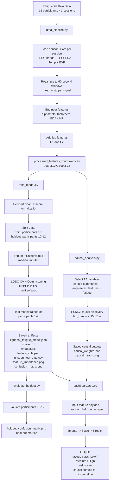

# Project Flowchart

## Notes

- Current project output directory: `outputs/XGBoost-v2`
- Main dataset artifact: `processed_features_windowed.csv`
- Model type: `xgb.XGBClassifier` with 3 fatigue classes
- Causal module is generated offline via PCMCI and stored separately from the classifier artifacts
